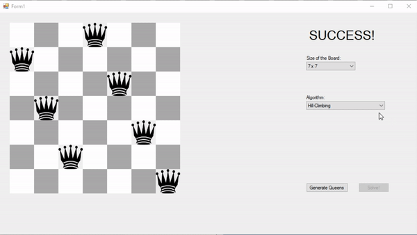

# Local Search Algorithms solving N-Queens Problem 

 
 

Solving N-Queens problem with C# implementation by using: 

* Hill-Climbing 

* Simulated Annealing 

* Local Beam Search 

* Genetic Algorithms. 

 
 

Properties of local search algorithms: 

* Each algorithm encounters the "fog problem" with the analogy of mountain-climbing in the fog. 

* They solve problems until they reach  the stopping criteria 

* They don't ensure the optimal solution 

* They have low space consuption 

 
 

In N-Queens problem we want to place N chess queens on an NxN chessboard so that no two queens attack each other. 

 
 

Heuristic h(x) = pairs of queens that are attacking each other, local optimum is reached when h(x)=0. 

 
 

## Hill-Climbing 

* We start from a random state, and we move in the direction of a better state 

 
 

## Simulated Annealing 

* Hill climbing does not search the whole search space, because it never makes a step towards a worse state 

* Simulated annealing ensures the fullness of search by making random moves 

 
 

## Local Beam Search 

* We start from k random states and in every step, we make successors from these k states 

* We finish, when one of the states is the solution, otherwise we select k best successors and repeat 

 
 

## Genetic Algorithm 

* The genetic algorithm is a local beam search variant, where successors are created by combining two ancestors, not just a single ancestor 

* Usually, we stop the algorithm after N iterations 

  * The optimal solution is not always achievable 

  * In this case, we are interested in the best possible solution (close to optimal) 
  

 
